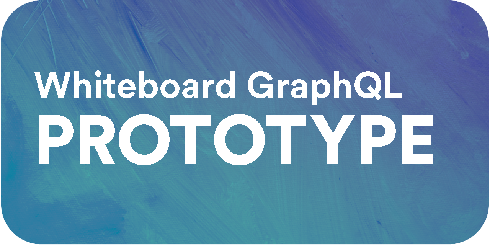

#  <!-- omit in toc -->


---

# Table of Contents <!-- omit in toc -->

- [Overview](#overview)
  - [Architecture](#architecture)
- [Zero to Hero](#zero-to-hero)
    - [Pre-requisites](#pre-requisites)
    - [General Setup](#general-setup)
    - [API Development Setup](#api-development-setup)
      - [Docker Build and Run](#docker-build-and-run)
    - [Infrastructure Deployment](#infrastructure-deployment)
      - [Bootstrap Deployment](#bootstrap-deployment)
      - [Infrastructure Deployment](#infrastructure-deployment-1)

# Overview

This repository contains a Node.js application that uses Expresses and Apollo Server to create a GraphQL API.

## Architecture


# Zero to Hero

### Pre-requisites

- [ ] [Node.js](https://nodejs.org/en) (version 20.x or later)
- [ ] [AWS CLI](https://aws.amazon.com/cli)
- [ ] [Terraform CDKTF](https://learn.hashicorp.com/tutorials/terraform/cdktf-install)
- [ ] [Docker](https://www.docker.com/get-started)

### General Setup
> The following steps are required to setup the project for local development and deployment.

1. Configure AWS CLI. You can do this with `aws configure`. If the environment you working with is managed by AWS SSO, you can run `aws configure sso`. For more on this see [AWS CLI Configuration](https://docs.aws.amazon.com/cli/latest/userguide/cli-configure-quickstart.html).

2. Enable `corepack` for `pnpm` to install the dependencies. You can do this by running the following command:

```bash
corepack enable pnpm
```

3. Download the repository

```bash
git clone git@github.com:AI-Whiteboard/PoC-Apollo-GraphQL-API.git
```

4. Run the install script. This will install the dependencies for the API and Infrastructure projects.

```bash
pnpm i
```

### API Development Setup
> The following steps are required for local development of the API.

1. Check into `/app` directory

```bash
cd app
```

2. Copy the `.env.example` file to `.env` and update the values as needed.

```bash
cp .env.example .env
```

2. Install the dependencies

```bash
pnpm install
```

3. Start the Docker container for the database and Python execution environment.

```bash
pnpm docker:up
```

3. Start the application in development mode

```bash
pnpm dev
```

#### Docker Build and Run

To run the application using Docker, you can run the following command:

```bash
docker build -t graphql-api .
docker run -p 3000:3000 graphql-api -e PORT=3000 -d
```

### Infrastructure Deployment
> The following steps are required to setup the project for deployment to AWS.

#### Bootstrap Deployment
The bootstrap setup is a one-time setup that will create the necessary resources in AWS to manage the remote state of the Terraform projects. For more information on this, see [Terraform Remote State](https://developer.hashicorp.com/terraform/language/state/remote).

1. Check into `/bootstrap` directory

```bash
cd bootstrap
```

2. Deploy the bootstrap stack

```bash
pnpm deploy
```

#### Infrastructure Deployment

1. Check into `/infrastructure` directory

```bash
cd infrastructure
```

1. Deploy the networking layer. Note, the first time you run this, it will create a new Hosted Zone in Route 53. You will need to point your domain registrar to the name servers provided by Route 53 so that it can manage the DNS records and auto-verify the SSL certificates created by this project.

```bash
pnpm deploy:networking
```

4. Deploy the App layer

```bash
pnpm deploy:apps
```

5. Deploy the client layer

```bash
pnpm deploy:client
```